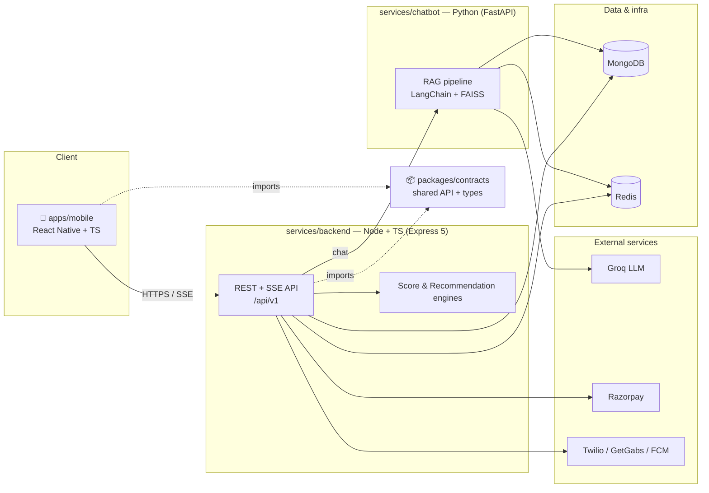

<div align="center">

# VivaMama

**An open-source postpartum & maternal-health platform — mobile app, core API, and a RAG chatbot, in one monorepo.**

[](https://github.com/NexaNeura/vivamama/actions/workflows/ci.yml)
[](https://github.com/NexaNeura/vivamama/actions/workflows/security.yml)
[](./LICENSE)
[](./CONTRIBUTING.md)

</div>

VivaMama (a.k.a. *Viva Nari*) helps mothers through the postpartum period. A mother
onboards, completes periodic **check-ins**, and receives a **Viva Recovery Score**
across three categories — *physical*, *lactation*, and *emotional* — which drives
personalized recommendations, educational content, products, and expert
consultations. An LLM-backed assistant (**Viva AI**) and a community (**Viva Club**)
round out the experience.

> This repository is the consolidation of three previously separate projects into a
> single, public monorepo. See [`MIGRATION_NOTES.md`](./MIGRATION_NOTES.md) for how
> it was assembled and what to review before relying on it.

## Architecture



- **apps/mobile** — the customer app (Android/iOS). Talks to the backend over HTTPS
  and Server-Sent Events (streamed chat/check-ins).
- **services/backend** — the system of record: auth, onboarding, check-ins, the
  Score & Recommendation engines, payments, messaging, and chat orchestration.
- **services/chatbot** — a retrieval-augmented assistant grounded in a
  maternal-health corpus; exposes tools (via MCP) that call back into the API.
- **packages/contracts** — the shared API endpoint registry and core domain types,
  so every service agrees on the contract.

## Tech stack

| Area | Technology |
| --- | --- |
| Mobile | React Native 0.81, React 19, TypeScript, React Navigation 7 |
| Backend | Node.js 20, TypeScript, Express 5, MongoDB (Mongoose), Redis (ioredis), Socket.IO + SSE |
| Chatbot | Python 3.10, FastAPI, LangChain, FAISS, sentence-transformers, Groq |
| Shared | TypeScript library (`@vivamama/contracts`) |
| Tooling | pnpm workspaces · Turborepo · uv · Ruff · ESLint · Prettier · Changesets · Docker |

## Quick start

### Prerequisites

- **Node.js ≥ 20** and **pnpm** (`corepack enable`)
- **Python ≥ 3.10** and **uv** (`pip install uv`) — for the chatbot
- **Docker** (optional, for the one-command stack)

### Install everything

```bash
git clone https://github.com/NexaNeura/vivamama.git
cd vivamama
pnpm install            # installs all JS/TS workspaces
```

### Run the whole stack with Docker

```bash
cp .env.example .env    # compose-level vars
docker compose up --build
```

This brings up MongoDB, Redis, the **backend** (`:4000`), and the **chatbot**
(`:8001`). The mobile app runs separately (Metro/native — see below).

### Run a single service

| Service | Commands |
| --- | --- |
| Backend | `cp services/backend/.env.example services/backend/.env` → `pnpm --filter @vivamama/backend dev` → http://localhost:4000/health |
| Chatbot | `cp services/chatbot/.env.example services/chatbot/.env` → `cd services/chatbot && uv sync && uv run uvicorn app.api.main:app --reload --port 8001` |
| Mobile | `cp apps/mobile/.env.example apps/mobile/.env` → `pnpm --filter @vivamama/mobile start` then `… android` / `… ios` |

Each package has its own README with full details:
[mobile](./apps/mobile/README.md) · [backend](./services/backend/README.md) ·
[chatbot](./services/chatbot/README.md) · [contracts](./packages/contracts/README.md).

## Repository layout

```
vivamama/
├─ apps/
│  └─ mobile/            React Native customer app  (@vivamama/mobile)
├─ services/
│  ├─ backend/           Node/TS core API           (@vivamama/backend)
│  └─ chatbot/           Python RAG chatbot         (@vivamama/chatbot)
├─ packages/
│  └─ contracts/         Shared API + domain types  (@vivamama/contracts)
├─ .github/              CI/CD workflows, issue & PR templates
├─ docs/                 Architecture & deeper docs
├─ docker-compose.yml    Full local stack
├─ turbo.json            Task pipeline (lint/typecheck/test/build)
└─ pnpm-workspace.yaml   JS/TS workspaces
```

## Common tasks (root)

```bash
pnpm lint            # turbo: lint every workspace (JS via ESLint, Python via Ruff)
pnpm typecheck       # turbo: type-check the TS workspaces
pnpm test            # turbo: run unit tests
pnpm build           # turbo: build all buildable packages
pnpm format          # Prettier across the repo
pnpm changeset       # record a versioned change (see CONTRIBUTING.md)
make help            # one-command helpers for the polyglot stack
```

## Why this tooling?

This is a **polyglot** monorepo (TypeScript + Python), so tooling is split by job:

- **pnpm workspaces** manage all JS/TS dependencies from one lockfile. We set
  `node-linker=hoisted` (`.npmrc`) so React Native's Metro bundler and native
  autolinking work (pnpm's default symlinked store breaks them).
- **Turborepo** orchestrates `lint`/`typecheck`/`test`/`build` across packages with
  caching and `--affected` filtering — including the Python service, via a thin
  `package.json` that shells out to uv. One task graph for the whole repo.
- **uv** manages the Python service (fast, lockfile-based, reproducible). **Ruff**
  handles Python lint **and** formatting (Black-compatible) from one tool.
- **ESLint + Prettier** provide the shared JS/TS baseline; the RN app and the
  backend keep small, framework-appropriate overrides (documented in
  [`CONTRIBUTING.md`](./CONTRIBUTING.md)).
- **Changesets** drives versioning and changelogs for the published workspaces.

CI runs each package's checks **only when that package (or shared config) changes**,
via path filtering + Turbo's affected detection.

## Contributing & security

- [`CONTRIBUTING.md`](./CONTRIBUTING.md) — setup, branching, commit conventions, PRs
- [`CODE_OF_CONDUCT.md`](./CODE_OF_CONDUCT.md) — Contributor Covenant
- [`SECURITY.md`](./SECURITY.md) — how to report a vulnerability (please do not open
  public issues for security reports)

## License

Apache-2.0 — see [`LICENSE`](./LICENSE) and [`NOTICE`](./NOTICE).
The chatbot's knowledge corpus is third-party and **not** included or relicensed;
see [`services/chatbot/data/SOURCES.md`](./services/chatbot/data/SOURCES.md).
