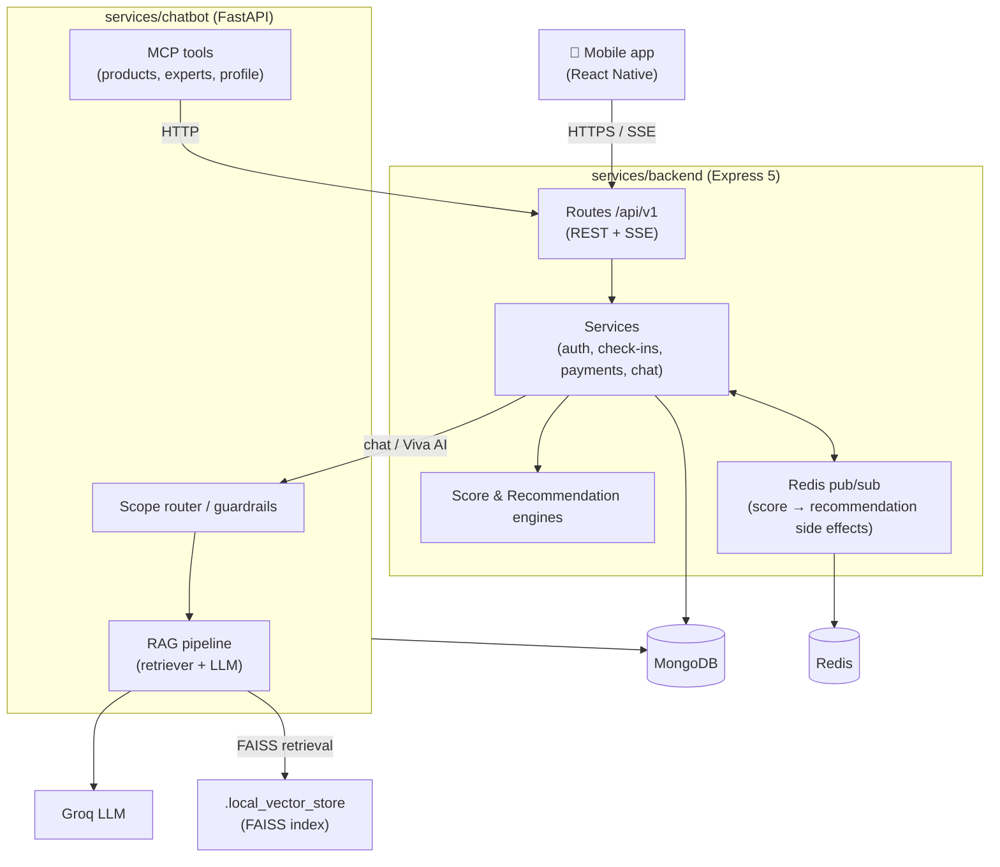

# VivaMama — Architecture

A high-level map of how the pieces fit together. Each service also has a deeper,
code-level guide:

- Backend — [`services/backend/PROJECT_OVERVIEW.md`](../services/backend/PROJECT_OVERVIEW.md)
- Mobile — [`apps/mobile/PROJECT_OVERVIEW.md`](../apps/mobile/PROJECT_OVERVIEW.md)
- Shared contract — [`packages/contracts/README.md`](../packages/contracts/README.md)

## System overview

## The core product loop

1. **Onboard** — a mother signs up (Google or phone OTP), completes a questionnaire,
   and selects a subscription.
2. **Check in** — periodic guided flows (weekly check-in, mood/sleep logs) streamed
   over SSE.
3. **Score** — the backend Score Engine turns answers into a **Viva Recovery Score**
   across *physical*, *lactation*, and *emotional* categories (raw + weighted, with
   zones and a weakest-category focus).
4. **Recommend** — the Recommendation Engine maps `week + zone + weakest category` to
   recommendations, content, and products; results persist as recommendation history.
5. **Support** — Viva AI (RAG chatbot) answers questions grounded in a maternal-health
   corpus; experts can be booked (Razorpay) for consultations.

## Shared contract

`@vivamama/contracts` is the single source of truth for API paths
(`apiRoutes`) and core domain types (`VivaRecoveryScore`, `Recommendation`,
`ApiResponse<T>`, …). The backend consumes it today; the mobile app and chatbot are
being migrated onto it (see [`MIGRATION_NOTES.md`](../MIGRATION_NOTES.md)).

## Runtime topology (local)

`docker compose up` starts MongoDB, Redis, the backend (`:4000`), and the chatbot
(`:8001`). The mobile app runs via Metro against the backend. In production the
services are containerized and deployed independently (e.g. Cloud Run); MongoDB and
Redis are managed instances.
