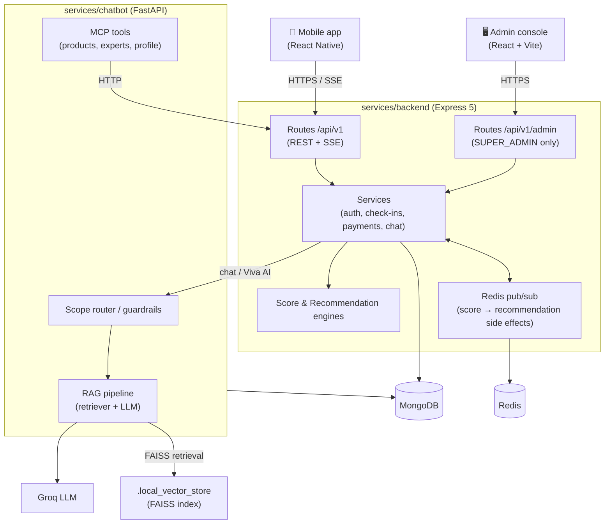

# VivaMama — Architecture

A high-level map of how the pieces fit together. Each service also has a deeper,
code-level guide:

- Backend — [`services/backend/PROJECT_OVERVIEW.md`](../services/backend/PROJECT_OVERVIEW.md)
- Mobile — [`apps/mobile/PROJECT_OVERVIEW.md`](../apps/mobile/PROJECT_OVERVIEW.md)
- Admin console — [`apps/admin/README.md`](../apps/admin/README.md)
- Shared contract — [`packages/contracts/README.md`](../packages/contracts/README.md)

## System overview

```mermaid
flowchart TB
  M["📱 Mobile app<br/>(React Native)"]
  A["🖥️ Admin console<br/>(React + Vite)"]

  subgraph BE["services/backend (Express 5)"]
    direction TB
    R["Routes /api/v1<br/>(REST + SSE)"]
    AR["Routes /api/v1/admin<br/>(SUPER_ADMIN only)"]
    SVC["Services<br/>(auth, check-ins, payments, chat)"]
    ENG["Score &amp; Recommendation engines"]
    PUB["Redis pub/sub<br/>(score → recommendation side effects)"]
  end

  subgraph CB["services/chatbot (FastAPI)"]
    direction TB
    ROUTER["Scope router / guardrails"]
    PIPE["RAG pipeline<br/>(retriever + LLM)"]
    TOOLS["MCP tools<br/>(products, experts, profile)"]
  end

  MDB[("MongoDB")]
  RDS[("Redis")]
  GROQ["Groq LLM"]

  M -->|HTTPS / SSE| R --> SVC --> ENG
  A -->|HTTPS| AR --> SVC
  SVC --> MDB
  SVC <--> PUB --> RDS
  SVC -->|"chat / Viva AI"| ROUTER --> PIPE --> GROQ
  PIPE -->|FAISS retrieval| VEC[".local_vector_store<br/>(FAISS index)"]
  TOOLS -->|HTTP| R
  CB --> MDB
```

## The core product loop

1. **Onboard** — a mother signs up (Google or phone OTP), completes a questionnaire,
   and selects a subscription.
2. **Check in** — periodic guided flows (weekly check-in, mood/sleep logs) streamed
   over SSE.
3. **Score** — the backend Score Engine turns answers into a **Viva Recovery Score**
   across *physical*, *lactation*, and *emotional* categories (raw + weighted, with
   zones and a weakest-category focus).
4. **Recommend** — the Recommendation Engine maps `week + zone + weakest category` to
   recommendations, content, and products; results persist as recommendation history.
5. **Support** — Viva AI (RAG chatbot) answers questions grounded in a maternal-health
   corpus; experts can be booked (Razorpay) for consultations.

## Shared contract

`@vivamama/contracts` is the single source of truth for API paths
(`apiRoutes`) and core domain types (`VivaRecoveryScore`, `Recommendation`,
`ApiResponse<T>`, …). The backend and the admin console consume it today — the
console's `apiRoutes.admin.*` entries mirror the backend's admin router exactly,
so a path cannot drift on one side alone. The mobile app and chatbot are still
being migrated onto it (see [`MIGRATION_NOTES.md`](../MIGRATION_NOTES.md)).

## The admin console

`apps/admin` is the operations surface: staff review and schedule consultations,
and work the moderation queue behind the app's report button. It is a static
React/Vite SPA — no server of its own — talking to `/api/v1/admin/*` with a
bearer token.

That route group is the only surface in the codebase that actually enforces
`SUPER_ADMIN`: `adminAuthMiddleware` requires the role claim *and* re-checks it in
the database, because a patient's token is signed with the same secret and would
otherwise pass.

## Runtime topology (local)

`docker compose up` starts MongoDB, Redis, the backend (`:4000`), and the chatbot
(`:8001`). The mobile app runs via Metro against the backend, and the admin console
via `pnpm --filter @vivamama/admin dev` (`:3039`) — both are client-side, so neither
is part of the compose stack. In production the
services are containerized and deployed independently (e.g. Cloud Run); MongoDB and
Redis are managed instances.
